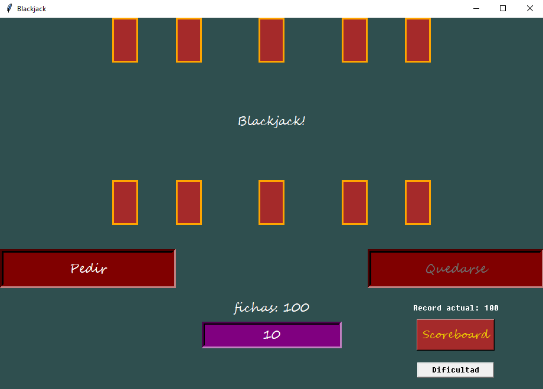
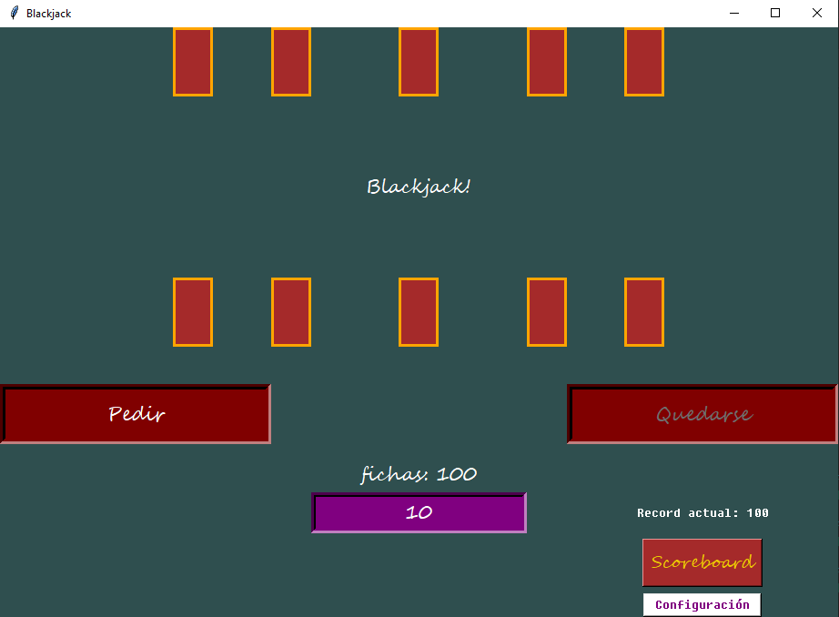
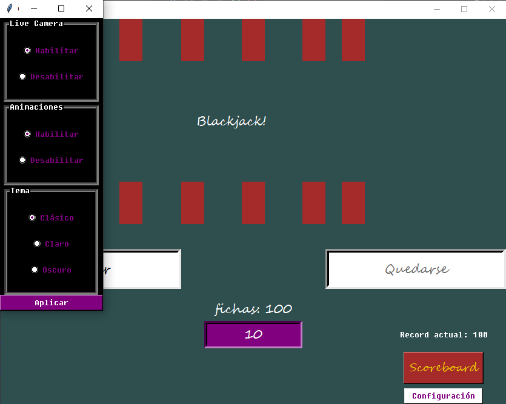
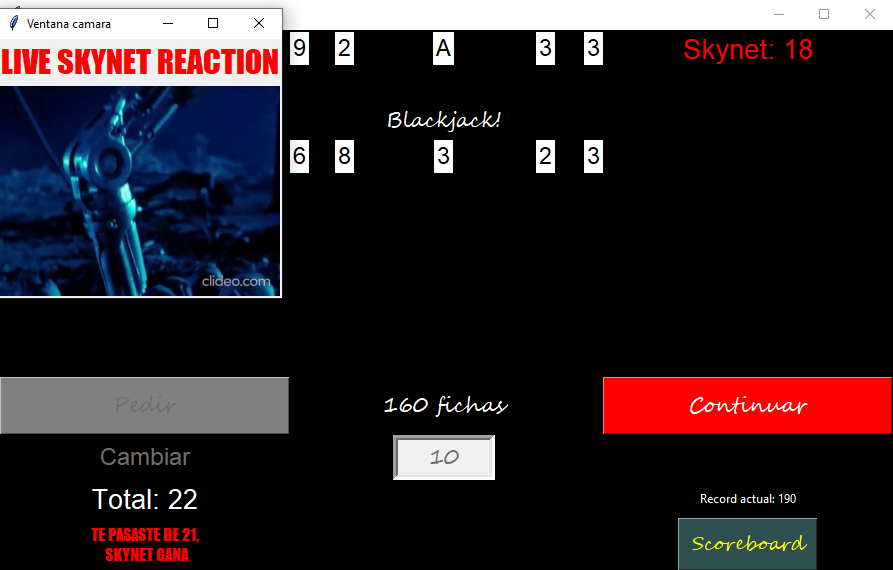
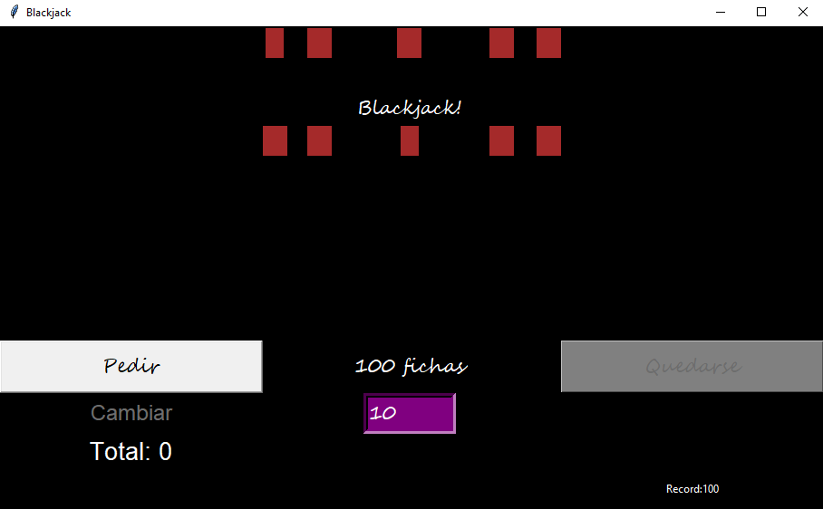
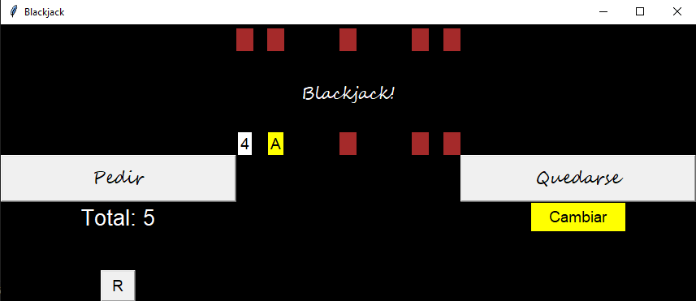
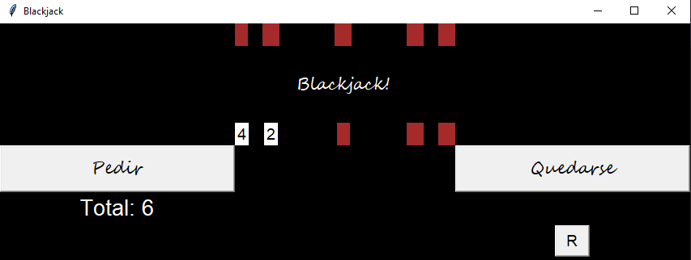

# Blackjack
### Basic Blackjack game, made with Python and its ugly Tkinter library

### [Version 7 (lastest version)](https://github.com/AxelGFC/Blackjack/commit/ac65a27ea4f3504b03974b0d5063f0289d7cfff9) 

- The "Live Reactions" feature has been removed.
- The Configuration menu has been removed.
- A new game mode called "Hardcore" has been added. This game mode has its own scoreboard.

### [Version 6](https://github.com/AxelGFC/Blackjack/commit/ab9b20a79b8bd119296f5ad55621a62de10671fa)

- The disign of the cards has been upgrated.
- New visual theme.

### [Version 5](https://github.com/AxelGFC/Blackjack/commit/a1824c2e9a383c0f62b872acd31e13ae2ff20887)

- A configuration button has been added. Now the player can customize:
    - Enable or disable the "Live Reactions".
    - Enable or disable the animations in the text.
    - Choose three diferent themes that can be applied (this is purely visual).

### [Version 4](https://github.com/AxelGFC/Blackjack/commit/f835421afa21ea6af378a1e5736b12ab9be336d2)

- After winning,losing or tying with Skynet, now there is now a random chance of a "Live reaction" window to appear.
- A scoreboard has been added. The player can insert a nickname and their record of fichas will be saved.

### [Version 3](https://github.com/AxelGFC/Blackjack/commit/357d8a4fa2f398c46e4a9dbb3fc9c043bea0a1e4)

- The player now needs to bet "fichas" (chips) to start a game. If the player wins, the fichas will multiply. If they losses, the fichas bet will be lost.
- The player can see in a corner a label that shows the maximum amount of fichas that were in their hands.

### [Version 2](https://github.com/AxelGFC/Blackjack/commit/6b9916048964e4b4622c83aef094c7d7661ce175)

- Now it is posible to change the Ace cards (which has a value of 1) to cards of 10.

### [First playable version](https://github.com/AxelGFC/Blackjack/commit/084986c0b2c889b59fc816a410aeaad6574af7af)

This is the first playable version of Blackjack. Your oponent will be skynet.
